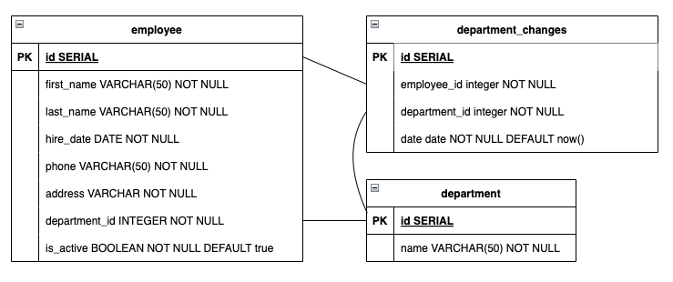

# Fullstack assessment - Number 8

## Description

This project is my solution to a full-stack assessment for a recruitment process. It is a simple application that allows users to create, list and delete employees, as well as editing a couple attributes.

It's divided into two parts: the `backend` API and the `frontend` application. You can see more details about each part here:

- [Backend API](backend/README.md)
- [Frontend Application](frontend/README.md)

## Requirements

- `Node.js 20.9.0` LTS. Should works on previous versions as weel, like *18.18.0* LTS.
- `Docker`. I'm currently using `v4.30.0`, but I think it should work on previous versions as well.

## Description of some decisions made

### Backend

I'm using the same entities for **Data access** layer and **Controller** layer. I'm using `TypeORM` to handle the database connection and migrations, and `Class Validator` to validate the `DTOs` (for request/responses). However, in such a simple application (or in such an early stage), I think it's fine to use the same entities for both layers.

I modeled `Address` as a text field. In real life, it would be a separate table in the database, with zip code, city, etc. But for this simple assessment, I finally decided it's fine to have it as a text field. There was nothing in the requirements to help me out with that decision, but just for the sake of simplicity (not dealing with city, state, country db tables and dropdowns that nobody required) I decided to keep it simple.

`Testing`. I covered some use cases, mostly the happy paths starting from the controllers. There are some tests to validate entities build restrictions. I mocked the repository responses only (the external stuff). HTTP response codes are not part of these tests. That probably should be covered by *e2e* tests.

I used an `interceptor` to store the **deparment changes history**, and that is a controllers thing. I'd prefer to apply decorators in the service layer instead, but there's no access to the context in service method decorators. Anyway, interceptors are indeed decorators, and the idea was decoupling use cases using composition instead of adding conditional logic.

### Frontend

I'm using `Material-UI` as a component library.

I'm not using a **state management library**, neither **context**. Usually, moving the state down into components was enough. Maybe there's some extra render after data fetching but it's fine for this simple application.

I'm fetching data client side only. And I reason about state like **client state** vs **server state**, handling the latest with **React Query**.

## Installation

### Dependencies

You'll have to install the js dependencies for **frontend** and **backend**. You can do that by running the following command:

```bash
cd backend
npm install
```

```bash
cd frontend
npm install
```

Then you can run the `frontend` application like this (keep reading for `backend` instructions):

`npm run build && npm run start`

And the tests like this:

`npm run test`

### Environment variables

In the backend folder: `cd backend`

Rename the `.env.example` file to `.env`.

`mv .env_example .env`

### Database

Remember you need to have **Docker** installed on your machine. Then run this command **inside backend folder**:

`docker-compose up --build`

That will create a database and then run the migrations. It will also launch the backend server.

Backend API runs on port `3001`.

You can run the tests like this:

`npm run test`

### Try it out

Head to [http://localhost:3000](http://localhost:3000) to see the application running.

Head to [http://localhost:3001/api](http://localhost:3001/api) to see the API running (handshake message).

## Database ER Diagram

A note about `Address`. I first started modeling it as a separate table, which I found reasonable given that addresses are composed by many parts. But finally I rolled it back to a `varchar`, since a new table would lead to a rabbit hole (extra tables for cities, states, countries). There's nothing in the mockups or requirements mentioning the desired address format or completeness. So I decided to focus on the explicit tasks and leave this as text field.


